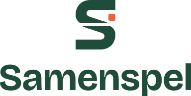

<p align="center">
  
</p>

# Samenspel

Samenspel is een webapplicatie waarmee je game-avonden en LAN-sessies organiseert
en eraan meedoet.

- Gebruikers maken een avond aan met een spel, categorie, datum, plek en een
  maximaal aantal deelnemers, en schrijven zich in op avonden van anderen.
- Bezoekers zoeken op titel en beschrijving en filteren op spel en categorie.
- Alleen de organisator kan zijn eigen avond wijzigen en openen of sluiten.
- Wie zelf een avond wil organiseren, moet zich eerst voor minimaal drie avonden
  van anderen hebben ingeschreven.
- Een admin beheert de spellen en categorieën.

De applicatie is gebouwd in Laravel.

## Techniek

| Onderdeel | Keuze                                                           |
| --------- | --------------------------------------------------------------- |
| Backend   | Laravel 13 op PHP 8.4                                           |
| Frontend  | Blade, SCSS met design tokens, Vite. Geen Tailwind of framework |
| Database  | MySQL, of SQLite lokaal                                         |
| Tests     | Pest 5, Larastan level 9, Pint en Prettier                      |
| Taal      | Nederlands (`nl`) met Engels als fallback                       |

## Aan de slag

Nodig: PHP 8.4+, Composer 2, Node 24 (zie [.nvmrc](.nvmrc)), npm 11+ en make. Op
Windows werk je in WSL2.

```bash
git clone <deze repository> && cd samenspel
make install
make dev
```

`make install` zet alles in één keer klaar: de PHP- en npm-dependencies, de git
hooks, een `.env` met applicatiesleutel, een gemigreerde en geseede database en
een eerste build van de assets. Opnieuw draaien kan geen kwaad. Aan het eind
staat de URL die je opent.

`make dev` start Vite met live reload, de queue en de logs. `make status` laat op
de regel `site` zien op welke URL de applicatie draait, `make stop` stopt alles.

Met Laravel Herd draait de site op `https://samenspel.test`. Herd serveert een map
alleen als die gelinkt is of direct in een geparkeerde map staat; zo niet, link
hem dan één keer vanuit de projectmap:

```bash
herd link --secure samenspel
```

### Testaccounts

`make fresh yes=1` leegt de database, migreert en seedt. De seed zet spellen,
categorieën en een paar demo-avonden van andere gebruikers klaar, plus twee
accounts om op `/login` mee in te loggen:

| Rol       | E-mail              | Wachtwoord |
| --------- | ------------------- | ---------- |
| Gebruiker | `test@example.com`  | `password` |
| Admin     | `admin@example.com` | `password` |

Deze accounts bestaan alleen in de lokale seed-data.

## Dagelijks werk

| Wat                           | Commando                            |
| ----------------------------- | ----------------------------------- |
| Alle make-targets             | `make`                              |
| Na een pull met een migration | `make migrate`                      |
| Controleren voor een push     | `make verify` (ongeveer 7 seconden) |
| Formatting herstellen         | `make format`                       |
| ERD opnieuw genereren         | `make erd`                          |
| Alles wat CI draait           | `make ci`                           |

Niemand commit direct op `main`. Werk gebeurt op `develop` of op een
`feature/<naam>`-branch die daarvan is afgesplitst. Commits volgen
`type(scope): onderwerp`, bijvoorbeeld `feat(events): add sign-up`. Zie
[docs/branching.md](docs/branching.md).

## Huisstijl

De kleuren, lettertypes, afstanden en vormen staan als design tokens (CSS custom
properties) in `resources/scss/abstracts/_tokens.scss`. Een component gebruikt
altijd een token, nooit een losse hex-waarde. Het logo zet je met `<x-logo />` op
een pagina; alle logobestanden staan in `public/brand/`.

| Token            | Kleur     | Gebruik                     |
| ---------------- | --------- | --------------------------- |
| `--color-paper`  | `#F6F1E7` | Achtergrond van de pagina   |
| `--color-felt`   | `#1F4D3A` | Koppen, navigatie, links    |
| `--color-accent` | `#F0603A` | Primaire knoppen (vulkleur) |
| `--color-ink`    | `#1B1F1C` | Tekst                       |

Het volledige design system, inclusief contrastwaarden en logo-regels, staat in
[docs/design-system.md](docs/design-system.md).

## Documentatie

- [docs/erd.md](docs/erd.md): het datamodel als ERD, met uitleg hoe je het leest.
- [docs/design-system.md](docs/design-system.md): kleuren, typografie, componenten
  en het logo.
- [docs/branching.md](docs/branching.md): `main`, `develop` en feature-branches.
- [docs/toolchain.md](docs/toolchain.md): de controles en de keuzes erachter.
- [AGENTS.md](AGENTS.md): de afspraken voor codeerassistenten.

## Licentie

**Alle rechten voorbehouden.** Dit is privéwerk, geen open source. Zie
[LICENSE](LICENSE). Het Laravel-skelet waarop dit gebouwd is blijft MIT
(© Taylor Otwell). Bricolage Grotesque valt onder de SIL Open Font License, zie
`resources/fonts/bricolage-grotesque/OFL.txt`.
