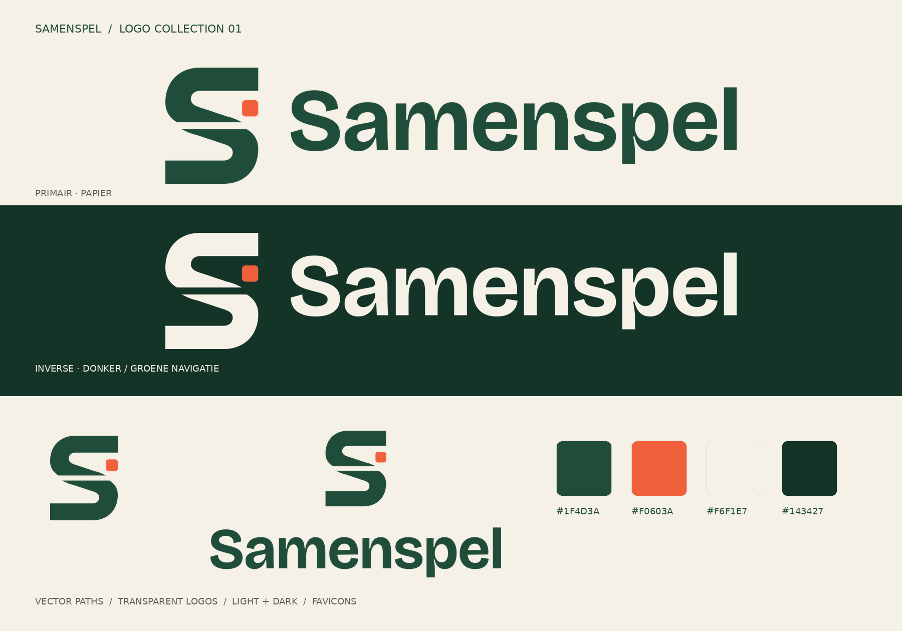

# Samenspel design system

Source of truth for the look of Samenspel (game-night planner). Direction: **speeltafel**. A warm paper background, deep green "table felt" as the dominant colour, one sharp coral accent for actions. Friendly and tactile, not a SaaS dashboard.

The style on top of that palette is **Memphis × line art × isometric** (section 3b): ink contours around every surface, a hard isometric depth beneath it, and loose geometric shapes and tilted labels as decoration. The whole style is set from one block of tokens, so it holds on every new page without per-component work.

All tokens live in [`resources/scss/abstracts/_tokens.scss`](../resources/scss/abstracts/_tokens.scss) as CSS custom properties on `:root`. Use them by name, for example `color: var(--color-felt)`.

Rules for this document:

- If the code and this document disagree, the code wins and this file is updated in the same commit.
- A token is never overridden by a hand-written hex value in a component. Add or change the token instead.
- UI copy is Dutch. Identifiers, comments and this document are English.

## 1. Colour tokens

Defined once as CSS custom properties on `:root`. There is no dark scheme: the brand has one light palette. WCAG AA is the floor: 4.5:1 for text, 3:1 for UI boundaries and focus indicators. Ratios below were calculated, not estimated.

### Core

| Token                  | Value     | Role                                        |
| ---------------------- | --------- | ------------------------------------------- |
| `--color-paper`        | `#F6F1E7` | Page background                             |
| `--color-surface`      | `#FFFBF2` | Cards, inputs, table rows                   |
| `--color-ink`          | `#1B1F1C` | Body text                                   |
| `--color-muted`        | `#5A615B` | Secondary text                              |
| `--color-line`         | `#D9D2C3` | Decorative dividers (not for input borders) |
| `--color-line-strong`  | `#8C8472` | Input and control borders                   |
| `--color-felt`         | `#1F4D3A` | Headings, nav, links, secondary buttons     |
| `--color-felt-dark`    | `#143427` | Footer, hover on felt                       |
| `--color-accent`       | `#F0603A` | Primary button fill                         |
| `--color-accent-hover` | `#F47B58` | Primary button hover fill                   |

### Semantic

| Token                  | Value     | Role                                         |
| ---------------------- | --------- | -------------------------------------------- |
| `--color-felt-tint`    | `#DCE8DF` | Background of the "Open" pill, success flash |
| `--color-neutral-tint` | `#E7E1D3` | Background of the "Gesloten" pill            |
| `--color-neutral-ink`  | `#4A514B` | Text on `--color-neutral-tint`               |
| `--color-warning-tint` | `#FBE9BD` | Background of the "Vol" pill, warning flash  |
| `--color-warning-ink`  | `#7A4B00` | Text on `--color-warning-tint`               |
| `--color-danger`       | `#B42318` | Error text and error borders on paper        |
| `--color-danger-tint`  | `#FBE4DF` | Error flash and field-error background       |
| `--color-danger-ink`   | `#8F1C13` | Text on `--color-danger-tint`                |

### Decoration

Memphis colours for shapes, tags and the illustration only. Never text, never a state.

| Token         | Value     | Role                                                   |
| ------------- | --------- | ------------------------------------------------------ |
| `--color-sun` | `#F6C445` | Memphis ring, home eyebrow label, pawn in the scene    |
| `--color-sky` | `#86CCCA` | Memphis dot, category tag on the event card (ink text) |

### Verified contrast

| Pair                                        | Ratio | Result  |
| ------------------------------------------- | ----- | ------- |
| ink on paper                                | 14.81 | AA, AAA |
| ink on surface                              | 16.15 | AA, AAA |
| muted on paper                              | 5.66  | AA      |
| muted on surface                            | 6.17  | AA      |
| felt on paper (links, headings)             | 8.55  | AA, AAA |
| felt on surface                             | 9.32  | AA, AAA |
| paper on felt                               | 8.55  | AA, AAA |
| paper on felt-dark                          | 12.03 | AA, AAA |
| ink on accent (primary button)              | 5.11  | AA      |
| ink on accent-hover                         | 6.21  | AA      |
| felt on felt-tint (Open pill)               | 7.64  | AA      |
| neutral-ink on neutral-tint (Gesloten pill) | 6.27  | AA      |
| warning-ink on warning-tint (Vol pill)      | 6.17  | AA      |
| danger on paper                             | 5.84  | AA      |
| danger-ink on danger-tint                   | 7.37  | AA      |
| line-strong on paper (input border)         | 3.30  | AA UI   |
| line-strong on surface (input border)       | 3.59  | AA UI   |

### Hard constraints from those numbers

- **Never put white text on `--color-accent`.** It measures 3.26 and fails AA. Accent buttons use `--color-ink` text.
- **Never use `--color-accent` as text colour, or as the only indicator of a state, on paper.** It measures 2.90. It is a fill colour.
- **On felt backgrounds the focus ring is `--color-paper`, not accent.** Accent on felt measures 2.95, just under 3:1.
- `--color-line` is decorative only. Input borders use `--color-line-strong`.
- State is never communicated by colour alone: pills carry a text label, errors carry a message.

## 2. Typography

| Role                                 | Family              | Fallback stack                                     |
| ------------------------------------ | ------------------- | -------------------------------------------------- |
| Display (h1 to h3, date stamp)       | Bricolage Grotesque | `"Helvetica Neue", Arial, sans-serif`              |
| Body and UI                          | Hanken Grotesk      | `"Helvetica Neue", Arial, sans-serif`              |
| Numbers (dates, counters, "2 van 3") | JetBrains Mono      | `ui-monospace, "SFMono-Regular", Menlo, monospace` |

| Token            | Family                                 |
| ---------------- | -------------------------------------- |
| `--font-display` | Bricolage Grotesque, then the fallback |
| `--font-body`    | Hanken Grotesk, then the fallback      |
| `--font-mono`    | JetBrains Mono, then the fallback      |

Fonts are self-hosted, not loaded from a third-party CDN, so no visitor IP goes to Google (AVG). Bricolage Grotesque is in `resources/fonts/bricolage-grotesque/` with its licence (SIL OFL) and is loaded by `base/_fonts.scss`. Hanken Grotesk and JetBrains Mono are not installed yet; until they are, the fallback stack renders. Adding them is a dependency change and needs approval first.

Scale (ratio 1.25, base 1rem = 16px):

| Token         | Size                     | Use                     |
| ------------- | ------------------------ | ----------------------- |
| `--text-xs`   | 0.8rem                   | Pill labels, captions   |
| `--text-s`    | 0.9rem                   | Helper text, table body |
| `--text-m`    | 1rem                     | Body                    |
| `--text-l`    | 1.25rem                  | Lead text, card titles  |
| `--text-xl`   | 1.563rem                 | h3                      |
| `--text-2xl`  | 1.953rem                 | h2                      |
| `--text-3xl`  | 2.441rem                 | h1                      |
| `--text-hero` | clamp(2.6rem, 6vw, 4rem) | Home hero only          |

| Token                | Value   | Use                                  |
| -------------------- | ------- | ------------------------------------ |
| `--leading-normal`   | 1.6     | Body                                 |
| `--leading-tight`    | 1.15    | Display                              |
| `--tracking-display` | -0.01em | Display headings                     |
| `--weight-normal`    | 400     | Body                                 |
| `--weight-semibold`  | 600     | UI labels, buttons                   |
| `--weight-bold`      | 700     | Display                              |
| `--measure`          | 70ch    | Maximum line length for running text |

## 3. Spacing, shape, elevation

Spacing is a 4px scale:

| Token         | Value   |
| ------------- | ------- |
| `--space-3xs` | 0.25rem |
| `--space-2xs` | 0.5rem  |
| `--space-xs`  | 0.75rem |
| `--space-s`   | 1rem    |
| `--space-m`   | 1.5rem  |
| `--space-l`   | 2rem    |
| `--space-xl`  | 3rem    |
| `--space-2xl` | 4rem    |

- Two radii only: `--radius-s` 6px (inputs, buttons), `--radius-m` 14px (cards, flash messages, modal). `--radius-full` 999px for pills.
- Hierarchy comes from the line-art contour and the isometric depth of section 3b, not from soft shadows. There are no blurred shadows anywhere.
- Focus ring: `--focus-ring-width` 3px, `--focus-ring-offset` 2px.
- Container: `--container-width` 72rem. Touch target: `--touch-target` 44px.

Breakpoints are a Sass map in `abstracts/_breakpoints.scss` (custom properties do not work in media queries): `s` 30rem, `m` 48rem, `l` 64rem, `xl` 80rem. Mobile first: `@include from('m') { ... }`.

## 3b. Style: Memphis × line art × isometric

All of it lives in the "Style" block of `_tokens.scss`. Change a value there and every component follows; no component draws its own line, depth or tilt.

| Token                                    | Default                 | What it sets                                                                               |
| ---------------------------------------- | ----------------------- | ------------------------------------------------------------------------------------------ |
| `--line-width`, `--line-color`, `--line` | 2px, ink                | The contour around cards, buttons, fields, pills, tags, dropdown, modal, header and footer |
| `--depth-s`, `--depth-m`                 | 3px, 6px                | The isometric offset: `s` for controls and small parts, `m` for cards, dropdown and modal  |
| `--depth-color`                          | ink                     | The colour of that offset                                                                  |
| `--shadow-depth-s/m/none`                | composed                | The offsets as `box-shadow` values, so a component never writes the offset by hand         |
| `--lift`                                 | half of `--depth-s`     | How far a control rises on hover                                                           |
| `--tilt`                                 | -3deg                   | The Memphis tilt of the date stamp and the home eyebrow                                    |
| `--pattern-dot`, `--pattern-dot-size`    | 1.2px dots on 22px grid | The dot grid behind every page                                                             |
| `--shape-*`                              | SVG masks               | Squiggle, triangle, ring, zigzag and cross, drawn by `<x-memphis>` in any colour token     |

**Line art.** Every surface and control has one ink contour of `--line-width`. The width never changes with state, so nothing grows a thicker edge on hover or focus; state shows as colour and depth.

**Isometric.** Surfaces sit on a hard, unblurred offset down and to the right, as if lit from the top left. Cards keep a fixed `--shadow-depth-m` and never move. Controls (buttons, pagination) rest on `--shadow-depth-s`, rise by `--lift` onto `--shadow-depth-m` on hover, and sink flat into their depth when pressed. The home illustration, `<x-iso-scene>`, is projected from 3D boxes on a true 30° grid, with a light, middle and dark tone per box.

**Memphis.** A dot grid behind the page, loose shapes from `<x-memphis>` (variants `header`, `hero`, `guest`) and labels tilted by `--tilt`. Shapes are decoration: `aria-hidden`, no pointer events, and most step aside below the `m` breakpoint so they never crowd a heading. Their colours are accent, felt, sun, sky and ink.

## 4. Motion

- Default transition `150ms ease-out` (`--duration-fast` and `--easing-standard`) on colour, background, border colour, box-shadow and transform only. Never on a border width.
- Only what acts on a click has a hover state. A card that is not a link does not move or change on hover: a hover on something that does nothing is a promise the page cannot keep. Controls rise on hover and sink when pressed (section 3b). Status toggle changes pill colour with the same 150ms transition.
- Menus have one tempo of their own: `--duration-menu` (280ms) on `--easing-menu`, for every part of opening and closing alike — the pressed toggle, the chevron, the menu button's bars, the panel and the menu rows. A toggle starts rising again the moment its menu starts closing, so the two move together. Hover feedback stays on `--duration-fast`.
- Everything inside `@media (prefers-reduced-motion: reduce)` drops to no transition and no transform.
- No page-load animations, no scroll animations.

## 5. Components

Each component has one SCSS partial and uses tokens only.

**Button.** Base: 44px minimum height (touch target), `--radius-s`, weight 600, `--text-m`, the `--line` contour on `--shadow-depth-s`. Hover rises by `--lift` onto `--shadow-depth-m`; pressed, it sinks flat.

- Primary: fill `--color-accent`, text `--color-ink`, hover fill `--color-accent-hover`.
- Secondary (the base `.button`): `--color-surface` fill, `--color-ink` text, hover fill `--color-felt-tint`.
- Danger: fill `--color-danger` with `#FFFFFF` text (6.57), hover `--color-danger-ink`.
- Ghost: no contour and no depth, hover fill `--color-felt-tint`, for low-priority actions.
- Link: reads as a link inside running text; no contour, no depth.
- Disabled: `--color-neutral-tint` fill, `--color-neutral-ink` text, no depth, `cursor: not-allowed`, `aria-disabled` set.

**Form field.** Label above the field, 600 weight. Input on `--color-surface` with the `--line` contour, `--radius-s`, 44px minimum height. The border width is the same in every state. Hover adds a `--depth-s` offset in `--color-line-strong`. Focus turns the border `--color-felt` and the offset felt; that colour-and-depth change replaces the global outline and is at least as visible. Helper text in `--color-muted`. Error state: border and message in `--color-danger`, field background `--color-danger-tint`, a danger offset on focus, message linked with `aria-describedby`. Server-side messages render in this slot (client-side checks are an addition, never the only validation).

**Card.** `--color-surface`, the `--line` contour, `--radius-m`, a fixed `--shadow-depth-m`. A card footer is divided by a dashed `--color-line-strong` line.

**Event card.** A card (above) with no hover. Three columns from the `m` breakpoint up:

- Left: the date stamp, the Memphis accent of the card: a `--color-felt` block with `--color-paper` text and the ink contour, tilted by `--tilt` on an accent-coloured `--depth-s`. Weekday and month abbreviation in mono, the day in the display face.
- Middle, in reading order: the game in `--color-felt`, bold and uppercase, with a gamepad icon, and the category as a `--color-sky` tag with the contour after it; the title (`--text-2xl` from `m`, `--text-xl` below), the largest text on the card; time and location in `--color-muted`, each with an icon.
- Right: a column of fixed width (12rem) behind a dashed divider, left-aligned so the status pill and the player counter ("4 / 8 spelers", mono) start at the same x on every card.

Below `m` the status and counter move under the details, behind a dashed divider. Once the detail page exists the title becomes the link; the card stays one block, not one big clickable area.

**Status pill.** `--radius-full`, the `--line` contour, `--text-xs`, weight 700, uppercase label with a leading dot.

- Open: `--color-felt` on `--color-felt-tint`
- Gesloten: `--color-neutral-ink` on `--color-neutral-tint`
- Vol: `--color-warning-ink` on `--color-warning-tint`

"Vol" is derived (signups reached `max_participants`), "Open" and "Gesloten" come from the stored status. A closed event that is also full shows "Gesloten".

**Status toggle button.** A small secondary button in the event list that posts to the toggle action. It lives in a `<form method="POST">` with the CSRF token, label switches between "Sluiten" and "Openen".

**Navigation.** Top bar in `--color-surface` with a `--line` bottom edge.

- From the `m` breakpoint up: the horizontal logo on the left; the main links in the true centre as one line-art pill, a segmented control on `--color-paper` where the current page is the filled `--color-felt` segment with paper text and a hover is `--color-felt-tint`; the account area on the right. A guest sees "Inloggen" as a text link and "Registreren" as a primary button. Someone signed in sees a chip in the button style: their initials in an `.avatar` (sun circle with the contour), their name and a chevron. Open, the chip is pressed into its depth and the menu drops in (`menu-in`) with the name, the email and icon rows for Profiel and Uitloggen; it leaves the same way (`menu-out`).
- Below `m`: the logo and a square menu button in the button style. It opens a full-screen menu that slides in from the left as it fades up. Its top row is built like the header row — same height, same container, same bottom line — so the logo lands exactly on the header's logo and the close button exactly on the menu button, drawn as that button looks once pressed (felt, flat in its depth). Below it: a mono "Menu" label, one row per page (icon, label in the display face, an arrow that slides in on hover; the current page filled felt on an accent depth), and below a dashed line the account part: avatar, name and email with Profiel and Uitloggen as block buttons, or Inloggen and Registreren for a guest. Memphis shapes (`drawer` variant) along the bottom. The rows arrive one after another, `--stagger` apart. The page behind does not scroll while the menu is open.
- Both menus are `<details>` and work without JavaScript. JavaScript adds the way out (the menu slides back out as it fades), Escape with focus returning to the toggle, closing on a click outside, and the close button inside the menu, which is hidden until then; with it, the outer menu button fades out while the menu slides in and fades back while it slides out. Without JavaScript the outer button stays on top, in the same place, and closes the menu. Reduced motion shortens every duration and the stagger to nothing.
- Admin link visible to admins only.

**Flash message.** `--radius-s`, the `--line` contour with a left bar three times as wide, on `--shadow-depth-s`. Three columns: an icon for the kind of message (check for success, triangle for an error, info otherwise), the title and text, and the close button in the top-right corner: a full 44px touch target with an ✕ icon and the label "Sluiten" for screen readers. Success: felt-tint with a felt bar and icon. Error: danger-tint with a danger bar and icon. Always has a text label ("Gelukt", "Fout") and `role="status"` or `role="alert"`.

**Back link.** `<x-back-link>`: an arrow and a label in `--color-felt`, the arrow sliding a step left on hover. Always a link to a named route, never `history.back()`. On the sign-in pages it sits top-left ("Terug naar home"); on an app page it sits above the `h1` through the layout's `back` and `backLabel` props, as on the profile ("Terug naar dashboard").

**Table (admin).** Header row `--color-felt` with paper text, rows on `--color-surface` with `--color-line` dividers, row actions right-aligned. Scrolls horizontally inside its own container below the `m` breakpoint.

**Pagination.** Each link is a small block in the button style: contour, `--shadow-depth-s`, rising on hover. The current page is filled `--color-felt` and pressed flat. Previous and next carry text, not only arrows.

**Page header.** The band under the navigation that holds a page's `h1` (`--text-3xl`) and an intro line (`--text-l`): `--color-felt-tint` with a `--line` bottom edge and the `header` variant of `<x-memphis>` on the right.

**Home.** A tilted `--color-sun` eyebrow label, the `--text-hero` heading in felt, one sentence, two buttons, and beside it `<x-iso-scene>` with the `hero` shapes. Side by side from `l`, stacked and centred below.

**Dropdown and modal.** `--color-surface`, the `--line` contour, `--radius-m`, `--shadow-depth-m`.

**Search and filter bar.** One row on desktop (search field, game dropdown, category dropdown, submit and reset), stacked on mobile. Selected values persist after submit.

**Empty state.** Short Dutch sentence plus one clear primary action, for example "Nog geen events gevonden. Pas je filters aan of organiseer er zelf een."

**Footer.** On every page, app and guest, below the fold. `--color-felt-dark` with a `--line` top edge and `--color-paper` text. Left: the dark horizontal logo and the tagline in `--color-felt-tint`. Right: two link columns under `--color-sun` mono headings, "Ontdekken" (Home, Events) and "Account" (Inloggen and Registreren for a guest, Dashboard and Profiel when signed in). Links turn sun and underlined on hover, and focus draws a paper ring, because a felt ring would vanish on felt. A bottom bar carries "© year Samenspel. Alle rechten voorbehouden." Every link is a route that exists.

## 6. Focus and accessibility

- Every interactive element has a visible `:focus-visible` outline: 3px solid `--color-felt`, 2px offset, on paper and surface. Form fields replace it with the felt border and felt depth of section 5, which is at least as visible.
- Focus from a mouse click or a tap draws no ring, and touch screens get no grey tap flash: the pointer already shows where it is. The keyboard ring is never removed. `<main tabindex="-1">` is a landmark, not a control, so it never draws one.
- Controls (buttons, menu links, toggles, page links) are not text-selectable, so a quick double click never highlights a label.
- No page focuses a field on arrival except a single-purpose form (log in, register, the password pages) and a dialog as it opens. An edit page such as the profile opens with nothing selected. On `--color-felt` and `--color-felt-dark` backgrounds the outline is `--color-paper`.
- Minimum touch target 44 by 44px.
- Form errors are announced (`role="alert"` on the summary, `aria-describedby` per field).
- The page has one `h1`, a skip link to main content, and `lang="nl"` on `<html>`.
- Icons are decorative unless they are the only content of a control, then they get an accessible label.

## 7. Voice (Dutch UI copy)

Informal ("je"), short, direct. Buttons use verbs: "Organiseer een event", "Schrijf je in", "Schrijf je uit", "Opslaan". Error messages say what to fix, not what went wrong in code. The organiser rule is explained, never just blocked: "Je hebt je voor 1 van de 3 events ingeschreven. Schrijf je nog voor 2 events in om zelf te organiseren."

## 8. Logo

The logo files are in `public/brand/` and the browser icons in `public/`. In Blade, use the component rather than an `` by hand:

```blade
<x-logo />                                  {{-- horizontal, light --}}
<x-logo layout="stacked" />                 {{-- logo above the name --}}
<x-logo layout="emblem" variant="dark" />   {{-- the S alone, on felt --}}
```

| Use                                        | `layout`     | `variant`                                             |
| ------------------------------------------ | ------------ | ----------------------------------------------------- |
| Paper or another light background          | `horizontal` | `light`                                               |
| Felt navigation, footer or dark background | `horizontal` | `dark`                                                |
| Square placement with the name             | `stacked`    | `light`/`dark`                                        |
| Avatar or the mark on its own              | `emblem`     | `light`/`dark`                                        |
| Only the name                              | `wordmark`   | `light`/`dark`                                        |
| One colour                                 | any          | `mono-felt`, `mono-paper`, `mono-black`, `mono-white` |

- Choose the variant by the background the logo sits on, not by the page. In the felt navigation it is always `dark`.
- `samenspel-horizontal-auto.svg` follows the system colour scheme. The UI has no dark scheme, so it is kept for use outside the app.
- Clear space around the logo: at least 20% of the emblem height. Minimum size: 180px wide for the horizontal logo, 32px high for the emblem; smaller than that, use the favicon.
- Scale proportionally. Do not rotate, distort, outline, or add a shadow or gradient. The coral chip is decorative: never use coral as text or as the only sign of a state.
- `public/brand/png/` holds transparent PNG exports for places that cannot take an SVG, such as a presentation or social image.
- The favicon has a felt background on purpose, so it stays recognisable in a browser tab. `favicon.ico` carries 16, 32 and 48 pixels; `icon-192.png` and `icon-512.png` are for `site.webmanifest`.

The wordmark is Bricolage Grotesque 700 with logo-specific letter spacing, drawn as vector paths, so the SVGs need no font installed. The emblem is an S of two opposing rounded shapes with a loose coral game chip: joining in and playing together.



## 9. SCSS organisation

`resources/scss/main.scss` is the only entry point, and its layers are the cascade order:

- `abstracts/`: `_tokens.scss` (the `:root` custom properties), `_breakpoints.scss` (the breakpoint map, `from()` and `visually-hidden` mixins)
- `base/`: `_fonts.scss`, `_reset.scss`, `_typography.scss`
- `layout/`: container, site frame, guest layout, page layouts
- `components/`: one partial per component, BEM-named (`.block__element--modifier`)
- `utilities/`: the few single-purpose classes

No component sets a raw hex value, font family or spacing literal. A value that has no token yet gets one in `_tokens.scss` first.
