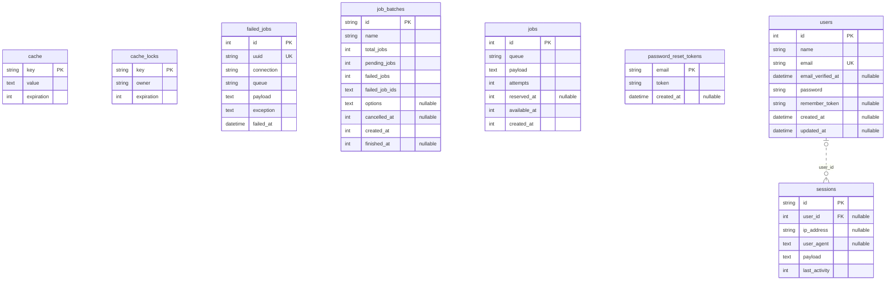

# Data model

The tables the migrations create, drawn as a Mermaid `erDiagram` that GitHub
renders in place.

The block between the `erd:start` and `erd:end` markers is generated. Run
`make erd` after changing a migration and commit the result; `make test` fails
while the diagram and the migrations disagree. Everything outside the markers
is yours to write: what an entity means, why a column exists, what is planned.

How to read it:

- `PK`, `FK` and `UK` mark the primary key, a foreign key and a single-column
  unique index. A column marked `nullable` accepts null.
- A solid line is a foreign key the database enforces. A dotted line is a
  relation inferred from Laravel's naming convention, such as a `user_id`
  column next to a `users` table, with no constraint behind it. A
  polymorphic `*_id` and `*_type` pair gets no line, because it can point
  at any table.
- `|o` on the parent side means the reference is nullable. `o|` on the child
  side means it is unique, so a parent has at most one such child.
- Types are normalised to `int`, `string`, `text`, `datetime`, `bool` and so
  on. The diagram is drawn from a throwaway SQLite database so that every
  machine draws the same one, which means it shows the kind of each column
  rather than the exact type your production database uses.

<!-- erd:start -->

<!-- erd:end -->
