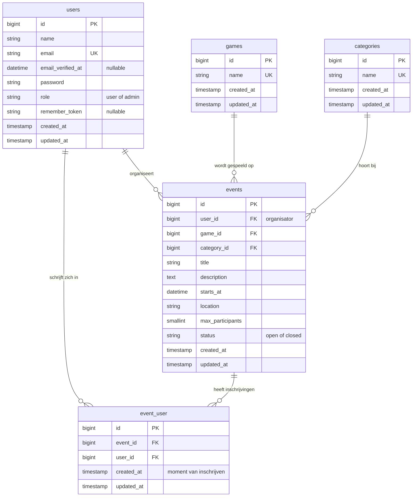
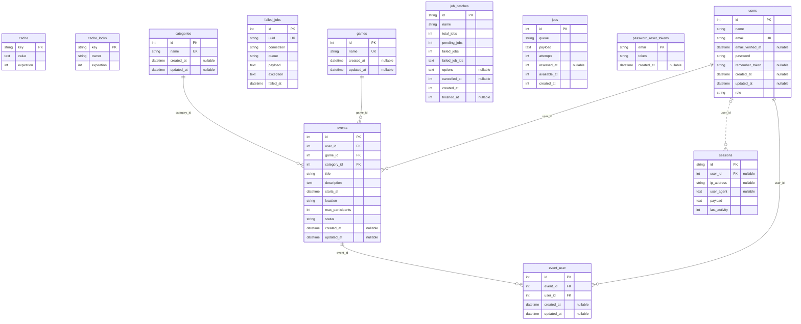

# Datamodel (ERD)

Het datamodel van Samenspel: welke tabellen er zijn, welke kolommen ze hebben en
hoe ze met elkaar verbonden zijn. GitHub tekent het diagram hieronder automatisch
uit de Mermaid-code.

De migrations in `database/migrations/` bouwen precies deze tabellen, en de
models in `app/Models/` (`User`, `Game`, `Category`, `Event`) hebben de relaties
die de lijnen tekenen. Wijkt de code af, dan wint de code en wordt dit bestand in
dezelfde commit bijgewerkt.

## Het diagram

## Zo lees je het diagram

**Een blok is een tabel.** De bovenste regel is de naam, daaronder staan de
kolommen met hun type.

| Afkorting | Betekenis   | Uitleg                                                         |
| --------- | ----------- | -------------------------------------------------------------- |
| `PK`      | Primary key | Het unieke nummer van een rij, bijvoorbeeld `events.id`        |
| `FK`      | Foreign key | Verwijst naar de `PK` van een andere tabel                     |
| `UK`      | Unique key  | Deze waarde mag maar één keer voorkomen, zoals een e-mailadres |

**Een lijn is een relatie.** De lijn loopt altijd van een `PK` naar een `FK`. De
tekens aan het uiteinde van de lijn (de "kraaienpoot") zeggen hoeveel rijen er aan
die kant bij één rij aan de andere kant horen:

| In de code | Op de afbeelding        | Betekenis   |
| ---------- | ----------------------- | ----------- |
| `\|\|`     | twee streepjes          | precies één |
| `o\|`      | cirkel en streepje      | nul of één  |
| `o{`       | cirkel en kraaienpoot   | nul of meer |
| `\|{`      | streepje en kraaienpoot | één of meer |

De kraaienpoot (het vorkje met drie pootjes) betekent altijd **meer**. Een cirkel
betekent **nul mag ook**, een streepje betekent **minimaal één**.

Lees een lijn altijd in twee richtingen, en kijk steeds naar het teken aan de
**overkant**. Voorbeeld voor `users` en `events`:

- Eén user organiseert **nul of meer** events (de kraaienpoot met cirkel bij `events`).
- Eén event heeft **precies één** organisator (de twee streepjes bij `users`).

Het woord op de lijn is de relatie als zin: "user _organiseert_ event". In de
code staat dat zo: `users ||--o{ events : "organiseert"`.

## De tabellen

| Tabel        | Wat erin staat                                                               |
| ------------ | ---------------------------------------------------------------------------- |
| `users`      | Iedereen met een account. `role` maakt iemand een gewone gebruiker of admin  |
| `games`      | De spellen die een admin beheert, bijvoorbeeld Mario Kart of Counter-Strike  |
| `categories` | De soorten avonden die een admin beheert, bijvoorbeeld LAN, Online of Casual |
| `events`     | Een game-avond of LAN-sessie, met spel, categorie, datum, plek en maximum    |
| `event_user` | De inschrijvingen: welke user op welk event ingeschreven staat               |

## Relaties

| Van          | Naar     | Soort        | In gewone taal                                                                                         |
| ------------ | -------- | ------------ | ------------------------------------------------------------------------------------------------------ |
| `users`      | `events` | één-op-veel  | Een user organiseert meerdere events, een event heeft één organisator                                  |
| `games`      | `events` | één-op-veel  | Een spel kan op meerdere events gespeeld worden, een event heeft één spel                              |
| `categories` | `events` | één-op-veel  | Een categorie hoort bij meerdere events, een event heeft één categorie                                 |
| `users`      | `events` | veel-op-veel | Via `event_user`: een user schrijft zich in op meerdere events, en een event heeft meerdere deelnemers |

### Waarom een tussentabel?

Een user kan zich op veel events inschrijven, en een event heeft veel deelnemers.
Zo'n **veel-op-veel**-relatie past niet in één kolom. Daarom staat er een
tussentabel (pivottabel) tussen: `event_user`. Elke rij daarin is één inschrijving
en bevat twee foreign keys, `event_id` en `user_id`. Zo wordt één veel-op-veel
relatie opgesplitst in twee één-op-veel relaties, en dat zie je in het diagram
terug als twee lijnen naar `event_user`.

`users` en `events` zijn dus op twee manieren verbonden, en dat zijn echt twee
verschillende dingen: `events.user_id` is de **organisator**, `event_user` zijn de
**deelnemers**.

## Ontwerpkeuzes

- `event_user` heeft een unieke index op de combinatie (`event_id`, `user_id`),
  zodat iemand zich niet twee keer op hetzelfde event kan inschrijven, ook niet als
  de validatie wordt omzeild.
- Er is geen kolom die bijhoudt op hoeveel events iemand ingeschreven staat. De
  regel "eerst op minimaal drie events van anderen ingeschreven voordat je zelf
  organiseert" telt dat met een query op `event_user`.
- Alleen inschrijvingen op events van anderen tellen mee (`events.user_id` is
  niet de user zelf). Op een eigen event inschrijven kan niet.
- `role` en `status` zijn gewone tekstkolommen met een PHP-enum in het model, geen
  database-enum, zodat de migrations eenvoudig blijven.
- Wordt een event verwijderd, dan verdwijnen de inschrijvingen mee
  (`cascadeOnDelete` op `event_user.event_id`). Een spel of categorie die nog bij
  een event hoort, kan niet verwijderd worden (`restrictOnDelete`).
- Verwijdert iemand zijn account, dan verdwijnen de events die hij organiseerde
  en zijn inschrijvingen mee (`cascadeOnDelete` op `events.user_id` en
  `event_user.user_id`).
- `role` en `events.user_id` kun je niet via een formulier invullen (ze staan niet
  in `$fillable`). Zo kan niemand zichzelf admin maken of een event op naam van
  een ander zetten.

## Gegenereerd schema

Technische controle: het schema zoals de migrations het nu bouwen

Dit blok wordt niet met de hand geschreven. `make erd` tekent het opnieuw uit de
migrations, en `make test` faalt zolang het niet klopt met de migrations. Het
bevat ook de standaardtabellen van Laravel (sessies, cache, wachtrij), die niet
bij het ontwerp hierboven horen.

<!-- erd:start -->

<!-- erd:end -->

